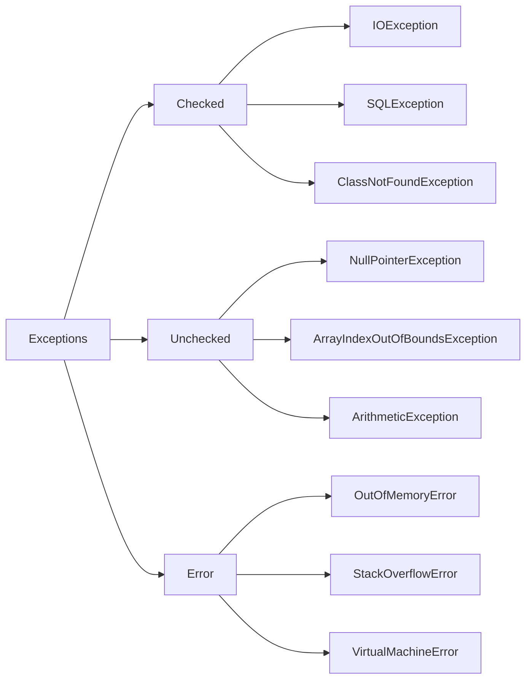

# Exception Handling

## What is an Exception?

Exception is an object that contains information about error

---

## 📊 Exception Hierarchy

## Checked Exceptions

- **Definition:** These are exceptions that the compiler checks at **compile-time**.
- **Responsibility:** Java requires to handle them explicitly using `try-catch` or `throws` clause.
- **Common Examples:**
  - `IOException`
  - `SQLException`
  - `ClassNotFoundException`
- **Use case:** When working with external resources like files or databases.

---

## Unchecked Exceptions

- **Definition:** Exceptions that are **not checked at compile-time** — they occur during **runtime**.
- **Responsibility:** Developer is responsible for identifying and preventing these with careful testing and validation.
- **Common Examples:**
  - `NullPointerException`
  - `ArrayIndexOutOfBoundsException`
  - `ArithmeticException`
- **Use case:** Often related to programming logic or coding mistakes.

---

## Errors

- **Definition:** These are serious issues that occur in the **JVM or system level** and are generally **not meant to be caught or handled**.
- **Common Examples:**
  - `OutOfMemoryError`
  - `StackOverflowError`
  - `VirtualMachineError`
- **Use case:** Critical failures like memory leaks or infinite recursions.
