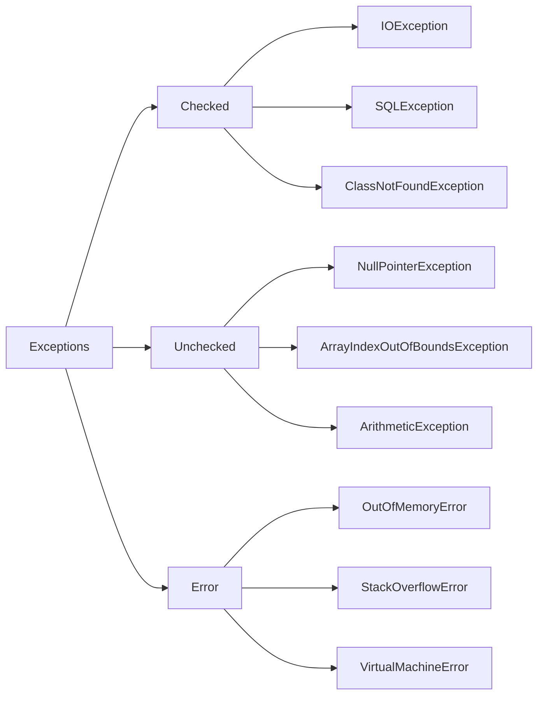

# Exception Handling

## What is an Exception?

Exception is an object that contains information about error

---

## 📊 Exception Hierarchy



## Checked Exceptions

- **Definition:** These are exceptions that the compiler checks at **compile-time**.
- **Responsibility:** Java requires to handle them explicitly using `try-catch` or `throws` clause.
- **Common Examples:**
  - `IOException`
  - `SQLException`
  - `ClassNotFoundException`
- **Use case:** When working with external resources like files or databases.

---

## Unchecked Exceptions

- **Definition:** Exceptions that are **not checked at compile-time** — they occur during **runtime**.
- **Responsibility:** Developer is responsible for identifying and preventing these with careful testing and validation.
- **Common Examples:**
  - `NullPointerException`
  - `ArrayIndexOutOfBoundsException`
  - `ArithmeticException`
- **Use case:** Often related to programming logic or coding mistakes.

---

## Errors

- **Definition:** These are serious issues that occur in the **JVM or system level** and are generally **not meant to be caught or handled**.
- **Common Examples:**
  - `OutOfMemoryError`
  - `StackOverflowError`
  - `VirtualMachineError`
- **Use case:** Critical failures like memory leaks or infinite recursions.

## Handling Exceptions with multiple Catch blocks

```java
    public static void show() {
        try {
            var reader = new FileReader("file.txt");
            var value = reader.read();
            new SimpleDateFormat().parse("");

        } catch (FileNotFoundException ex) {
            System.out.println(ex.getMessage());
        } catch (IOException e) {
            System.out.println("Could not read data");
        } catch (ParseException e) {
            System.out.println("Could not parse data");
        }
    }
```

> Above code works fine

```java
    public static void show() {
        try {
            var reader = new FileReader("file.txt");
            var value = reader.read();
            new SimpleDateFormat().parse("");

        }
        catch (IOException e) {
            System.out.println("Could not read data");
        } catch (FileNotFoundException ex) {
            System.out.println(ex.getMessage());
        } catch (ParseException e) {
            System.out.println("Could not parse data");
        }
    }
```

❗ This code throws a compilation error because `FileNotFoundException` is a subclass of `IOException`.
If you place the `catch (IOException e)` block before `catch (FileNotFoundException e)`, then the compiler considers the more specific catch block unreachable.

> That’s why the **order of catch blocks must be from most specific to most general**.


## Try with Resources

```java
        try (
            var reader = new FileReader("file.txt");
            var writer = new FileWriter("...")) {
            reader.read();
        } catch (IOException e) {
            System.out.println("Could not read data");
        }
```

> Try-with-resources is a feature that automatically closes resources when the try block exits. It is compiled into a try-finally block, where the close() method is called on each resource. The resource classes (like FileReader and FileWriter) must implement the AutoCloseable interface, which defines the close() method.

> ✅ **Note:** You can declare multiple resources in the same `try` block, separated by semicolons.

## Chaining Exceptions

Java provides a concept **Chaining Exceptions** when wrapping specific exceptions inside a general/custom exception

### Example: Using `initCause()`

```java
public void withdraw(float value) throws AccountException {
 if (value > balance) {
    var fundsException = new InsufficientFundsException();
    var accountException = new AccountException();
    accountException.initCause(fundsException);
    throw accountException;
 }
}
```

- `initCause(Throwable cause)`: is a method available on the Throwable class (and hence Exception) that allows you to attach the cause of an exception.

> **Bonus Tip💡** A concise and cleaner way to chain excpetions is to use **parametrized constructor** that takes cause(Exception).

📄Bonus example in: [`Account.java`](./Account.java)
