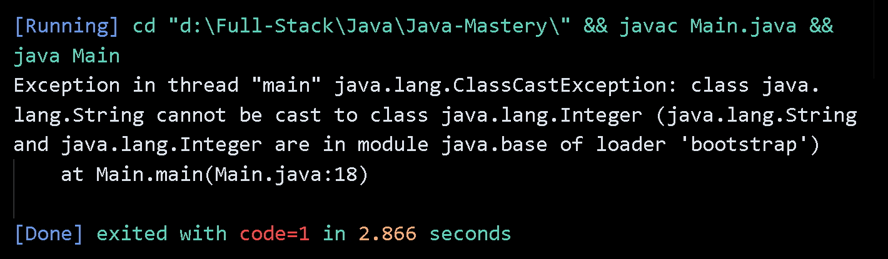

# Generics

- Generics allow classes, interfaces, and methods to operate on objects of various types while providing **compile-time type safety**.
- With generics, you can write code that works with different data types without specifying the exact type in advance.
- The compiler ensures type correctness, reducing the risk of runtime errors like `ClassCastException`.

> `ClassCastException` is a runtime exception thrown when an object is cast to a subclass it is not an instance of.

---

## Without Generics – Unsafe Example

```java
public static void main(String[] args) {
    var list = new List(); // Raw type using Object internally

    list.add(Integer.valueOf(1));
    list.add("3");                // String added to an Object array
    list.add(new User());         // Custom class added

    int number = (int) list.get(0); // OK
    int temp = (int) list.get(1);   // ❗ClassCastException
}
```

> ❗ `int temp = (int) list.get(1);`

This line throws a `ClassCastException` at runtime because the object being cast is not an `Integer` but a `String`.

> See error: 

---

## Generics Example

For code check: [Generics Example](./GenericList.java)

> The compiler shows warning of **Unchecked or Unsafe Operations**. because **Java does not allow the direct creation of generic arrays** due to **type erasure** (type information `T` is not available at runtime. At runtime, the JVM only sees `Object[]`, not `T[]`).

---

## Type Erasure Happens at Compile Time

After checking that your code is type-safe, the compiler erases all generic type information.

> At runtime, there’s no trace of `T`. It has been replaced with raw types (usually `Object`).

- The compiler checks `T` at compile time.
- Then it erases `T`, converting everything into raw types.
- The JVM only sees non-generic code — it runs as if generics never existed.
- This leads to limitations like not being able to create `new T[]`.

> 💡 Even though generics are erased at runtime, the compiler inserts `checkcast` instructions into the bytecode for type safety when needed.

For example, `T get()` becomes `Object get()` at runtime, but the compiler may insert a `checkcast` to your expected type.

---

## Analyzing Type Erasure using `javap`

To inspect the compiled bytecode, follow these steps:

### Step 1: Compile your Java source file

```bash
javac Main.java
```

### Step 2: View the bytecode using `javap`

```bash
javap -c Main
```

### Observations from Bytecode

- 🧾 **Observation #1**: No `<T>` exists in bytecode
- 🧾 **Observation #2**: `checkcast` appears for both `String` and `Integer`

> This confirms that `T` is erased to `Object`, and type logic is handled at compile time only.

---

## Examples and Bytecode

### ✅ Example 1: No `checkcast` for `Integer`

**Java Code:**

```java
System.out.println("Value of item at index 1: " + intItems.get(1));
```

**Compiled Bytecode (javap -c Main):**

```java
// For intItems.get(1) (GenericList<Integer>):
37: invokevirtual #26  // Method get(int): Object
40: invokestatic  #30  // Method String.valueOf(Object)

// ✅ No checkcast for Integer
```

---

### ⚠️ Example 2: `checkcast` inserted for `String`

**Java Code:**

```java
System.out.println("Value of item at index 2: " + moviesItems.get(2));
```

**Compiled Bytecode (javap -c Main):**

```java
// For moviesItems.get(2) (GenericList<String>):
82: invokevirtual #26  // Method get(int): Object
85: checkcast     #31  // class java/lang/String

// ⚠️ checkcast for String is inserted
```

---

## Why Does This Happen?

### 1️⃣ String Concatenation with `+` Uses `String.valueOf()` Internally

```java
System.out.println("Value: " + something);
```

- If `something` is not a `String`, `String.valueOf(Object)` is called.
- This method accepts `Object`, so no cast is needed.
- That’s why `intItems.get(1)` works without inserting `checkcast`.

---

### 2️⃣ `intItems.get(1)` → ✅ No Cast Needed

```java
String s = String.valueOf(intItems.get(1));
```

- Since `String.valueOf(Object)` accepts any object, no cast is required.
- The compiler doesn’t insert `checkcast`.

---

### 3️⃣ `moviesItems.get(2)` → ⚠️ Cast Required

```java
String s = "Value of item at Index 2: " + moviesItems.get(2);
```

- The compiler knows `get(2)` should return a `String`.
- String concatenation is compiled into:

```java
"Value: ".concat((String) moviesItems.get(2));
```

- So it inserts a `checkcast String` to ensure type safety.

---

### 4️⃣ Assigning to a Specific Type

```java
Integer x = intItems.get(1);
System.out.println(x);
```

- Here, the result of `get()` is assigned to a variable of type `Integer`.
- So the compiler inserts:

```java
checkcast java/lang/Integer
```

---

### ✅ Final Insight

The compiler knows the type of the list (`GenericList<T>`) during compilation.

But:

- 🔓 If the result is passed to something that accepts `Object`, no cast is inserted.
- 🔐 If a specific type is expected (e.g., assignment or concatenation), the compiler inserts a `checkcast` for safety.

This behavior ensures **compile-time type safety**, even though type information is erased at runtime.

---

## Autoboxing and Unboxing:

Java provides automatic conversion between primitive types and their corresponding wrapper classes, known as autoboxing and unboxing.

- **Autoboxing**: The automatic conversion of a primitive type to its corresponding wrapper class (e.g., int to Integer).
- **Unboxing**: The automatic conversion of a wrapper class object to its corresponding primitive type (e.g., Integer to int).

---

## Constraints in Generics

You can **add constraints** to type parameters in a generic class using `extends` (for classes) or `implements` (for interfaces).  
This ensures **only data types that satisfy the constraint** can be used with the generic class.

### Example: Bounded Type Parameter

👉 See [Bound Type Constraint](./GenericList.java)

> The generic class has a constraint on `Number`,  
> so trying to use a type like `String` (which is not a subclass of `Number`) results in a compilation error.

🖼️ See error screenshot:  


### Type Erasure with Bounded Constraints

After analyzing the compiled bytecode of `GenericList<T extends Number>` using `javap`, observed that **all instances of `T` are replaced with `Number`** after compilation.

This is because the Java compiler erases the type parameter `T` and replaces it with its bound (`Number`), just like how `T` is erased to `Object` in an unbounded generic.

🖼️ See screenshot:  


---

## Wildcards

In generic code, the question mark (?), called the wildcard, represents an unknown type.

### Upper Bounded Wildcards

- Upper bounded wildcard restricts the unknown type to be a specific type or a subtype of that type. For example, say you want to write a method that works on `List<Integer>`, `List<Double>`, and `List<Number>`; you can achieve this by using an upper bounded wildcard.
- To declare an upper-bounded wildcard, use the wildcard character ('?'), followed by the `extends` keyword, followed by its upper bound.

### Lower Bounded Wildcards

- A lower bounded wildcard restricts the unknown type to be a specific type or a super type of that type.
- To declare an lower-bounded wildcard, usethe wildcard character ('?'), following by the super keyword, followed by its lower bound: <? super A>.
- To write the method that works on lists of Integer and the supertypes of `Integer`, such as `Integer`, `Number`, and `Object`, you would specify `List<? super Integer>`.

> Note: You can specify an upper bound for a wildcard, or you can specify a lower bound, but you cannot specify both.

### Unbounded WildCards

- The unbounded wildcard type is specified using the wildcard character (?), for example, List<?>. This is called a list of unknown type.
- It is used for writing a method that can be implemented using functionality provided in the Object class.
- Used when When the code is using methods in the generic class that don't depend on the type parameter. For example, `List.size` or `List.clear`.
