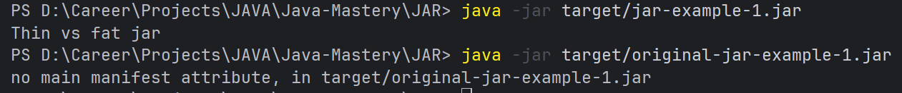

# JAR

## What is a JAR?

A JAR (Java ARchive) is a package file format (based on ZIP) that aggregates compiled Java class files, associated metadata, and resources (text, images, configuration files, etc.) into a single distributable unit.

---

## Thin JAR vs Fat (Uber) JAR

**Thin JAR**
: Contains only the project’s compiled classes and resources.  
Third-party dependencies are **not** included and must be supplied separately on the runtime classpath.  
Thin JARs are small and are commonly used with application servers or environments that manage the classpath externally.

**Fat (Uber) JAR**
: Bundles the project classes **and all third-party dependencies** into a single executable JAR.  
This simplifies distribution (one file to run) but increases size and may introduce duplicate resources or class-path conflicts.  
Commonly built using the Maven Shade Plugin or Maven Assembly Plugin.

---

## Troubleshooting from Local Maven Runs

A minimal example exists under `JAR/src/main/java/` (`JarExample.java`) and was used to build a thin JAR with Maven.  
During experimentation, the following issues were encountered.

### 1) No Source Files → Empty JAR

If no `.java` files exist under `src/main/java/`, Maven reports *“No sources to compile”* and produces an effectively empty JAR.

- 
- 

**Fix**
- Ensure all production sources are placed under `src/main/java`.

---

### 2) Invalid `main` Method Signature

A runnable JAR requires a valid entry point:

```java
public static void main(String[] args)
```
If the signature is incorrect, the runtime cannot locate a proper entry point.

- 

**Fix**
- Use the exact main method signature shown above.

---

## Understanding the `target/` Directory

The `target/` directory is Maven’s build output directory.  
Everything inside it is **generated**, **re-creatable**, and **must not be committed** to version control.

> [!IMPORTANT]
> The `target/` directory is created automatically when you run Maven goals such as:
> `mvn compile`, `mvn package`, or `mvn install`.

### Common Contents

| Path | Purpose |
|------|---------|
| `target/classes/` | Compiled `.class` files produced from `src/main/java` and copied resources from `src/main/resources` |
| `target/generated-sources/annotations/` | Java source files generated by annotation processors |
| `target/maven-archiver/` | Metadata describing the built artifact |
| `target/maven-status/` | Incremental build state used by Maven plugins |
| `target/<artifactId>-<version>.jar` | Final packaged artifact (thin JAR by default) |

---

### `target/maven-archiver/`

This directory is created by **maven-archiver**, a utility library used internally by:

- `maven-jar-plugin`
- `maven-war-plugin`
- `maven-shade-plugin`
- `spring-boot-maven-plugin`

**Contents**
- `pom.properties`; Stores Maven coordinates:
    - `groupId`
    - `artifactId`
    - `version`

**Use cases**
- Allows tooling and runtime environments to identify:
    - Which project produced the artifact
    - The exact version of the artifact

> [!NOTE]
> `maven-archiver` does **not** compile code and does **not** package classes.
> Its sole responsibility is to write metadata that can be inspected later.

---

### How to run Thin JAR file

```shell
java -cp "target/jar-example-1.jar;C:\Users\<you>\.m2\repository\org\apache\commons\commons-lang3\3.14.0\commons-lang3-3.14.0.jar" JAR.JarExample
```

#### How this works? 
`-cp / -classpath`

Classpath includes:
- Compiled application JAR
- External dependency JARs

Java then:
- Loads JAR.JarExample
- Sees StringUtils
- Finds it in commons-lang3.jar
- Executes main()

---

### Why java -jar DOES NOT work for thin JARs?
Java behaviour

- Ignores -cp
- Uses ONLY what’s inside the JAR
- Tries to run JarExample.java
👉 Dependency JARs are invisible → 💥 NoClassDefFoundError


---

## Fat (Uber) JAR using Maven Shade Plugin

A Fat JAR packages:
- Application classes
- All third-party dependencies
- This allows the application to be executed using a single command.

### What Happens During mvn package
- `maven-compiler-plugin` compiles Java sources
- `maven-jar-plugin` creates the original thin JAR
- `maven-shade-plugin`
  - Renames the thin JAR to: `original-jar-example-1.jar`
  - Creates a new **fat** JAR: `jar-example-1.jar`
  - Embeds all dependency classes
  
### Running the Fat JAR

```java
java -jar target/jar-example-1.jar
```
- ✔ No classpath required
- ✔ All dependencies bundled
- ✔ Single-file deployment

- 


> [!IMPORTANT]
> `maven-jar-plugin` is a **default Maven plugin** that runs automatically during the `package` phase for projects with:
> ```xml
> <packaging>jar</packaging>
> ```
> If packaging is not specified, Maven defaults to jar.

---
