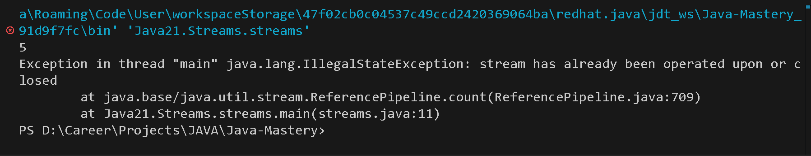

# Streams

Stream API (Java 8+) is a framework for processing data in a declarative, functional, pipeline-based style.
It allows you to perform:

- Filtering
- Mapping
- Sorting
- Reducing
- Aggregation
- Parallel Processing

on **collections** or **data sources**

> A Stream is NOT a data structure: It does not store values; it just describes a pipeline of operations to apply to data.

## Stream Pipeline

A stream pipeline has three parts

1. Source: Where data comes from. Examples: `Collections -> list.stream()`, `Arrays -> Arrays.stream()`, `Files -> Files.lines()`
2. Intermediate Operation(Lazy): These return a new _stream_. Examples: `filter()`, `map()`, `sorted()`, `distinct()`, `limit()`, `skip()`. They do nothing unless a terminal is performed.

   ```java
   List<Integer> num = List.of(2, 5, 4, 8, 10, 9);
   Stream<Integer> numStream = num.stream().filter(x -> x % 2 == 0).map(x -> x * 2);
   ```

3. Terminal Operations(eager): These trigger evaluation. Examples: `forEach()`, `collect()`, `reduce()`, `count()`, `findFirst()`, `anyMatch()`

> Once terminal is called, stream is consumed and can’t be reused.

Code:

```java
List<String> names = List.of("A", "B", "C", "D", "E");
Stream<String> nameStream = names.stream();
System.out.println(nameStream.count());
System.out.println(nameStream.count());
```

Output:



## Streams working Under the hood

### Lazy Evaluation

- Streams build a pipeline of operations internally as objects called PipelineHelper.
- Nothing runs until a terminal operation is invoked.

### Internal Architecture

- Every intermediate operation is represented by:
  - A **Sink** (consumer)
  - A **Pipeline stage** (linked list of operations)
- Under the hood Java creates a chain: Each op wraps the next using decorator pattern.
- **Vertical iteration**: Data elements are pulled one-by-one through the pipeline when terminal op is reached. Each element passes through all intermediate operations.

### Spliterator (core of Stream)

- A Spliterator is the engine behind Streams.
- Its responsibilities:
  - Iteration of elements using `tryAdvance()`
  - Bulk iteration using `forEachRemaining()`
  - Splitting data efficiently using `trySplit()` (important for parallel streams)
  - Estimating size: `estimateSize()` / `getExactSizeIfKnown()`
  - Determining characteristics: **ORDERED**, **SORTED**, **SIZED**, **IMMUTABLE**, **DISTINCT**, **SUBSIZED**, **CONCURRENT**

## How Parallel Stream Works Internally

- The Spliterator splits data using trySplit() recursively
- Each sub-spliterator is sent to a ForkJoinPool worker thread
- Each thread processes its subset through the pipeline stages (filter, map, etc.)
- Partial results are merged efficiently
- Terminal operation completes once all threads finish

> Parallel streams rely heavily on Spliterator splitting for workload division and parallel efficiency.

## Decorator pattern

Decorator pattern means:

- You have a chain of objects
- Each object keeps a reference to the next object
- Each object does something (e.g., filter), then forwards the element to the next object (e.g., map)

### How Streams Use the Decorator Pattern (Internally)

☕ Let’s Visualize the Wrapping

Stream code:

````java
stream.filter(f1).map(f2).forEach(f3);
```java
````

Internal structure (conceptually):

`FilterSink wraps ( MapSink wraps ( ForEachSink ) )`

🎨 Visual Diagram

     ┌──────────────┐       ┌────────────┐       ┌────────────┐
     │   FilterOp   │ ----> │   MapOp    │ ----> │ ForEachOp  │
     └──────────────┘       └────────────┘       └────────────┘
             │                      │                   │
     Checks predicate        Applies mapping      Prints the value

Each op wraps the next one like:

> FilterOp( MapOp( ForEachOp ) )

## Types of Streams

1. **Object Streams** `Stream<T>`

- Streams from Lists, Maps, Sets
- Usecases: Complex objects, user-defined types
- Backed by: Collection Spliterator, I/O Spliterator

2. **Primitive Streams**

- Java provides three special primitive streams: `IntStream`, `LongStream`, `DoubleStream`
- Reasons: Avoids boxing/unboxing, Faster through Pipeline, Specialized operations(sum, average, range)
- Backed by: `Spliterator.OfInt`, `Spliterator.OfDouble`

## Types of Streams by Source

1. **Collection Streams:** Created from Collections.
   - These use collection spliterators, e.g.:
     - ArrayList → ArraySpliterator
     - HashSet → HashMapSpliterator
     - TreeSet → TreeMapSpliterator
   - Spliterator used here are: ORDERED, SIZED, SUBSIZED, Splittable multiple times
2. **Array Streams:** Created from Array
   - Backed by: `ArraySpliterator`
   - Characteristics: ORDERED, SIZED, IMMUTABLE, Very fast to split (midpoint)

## Why Different Streams Need Different Spliterators?

Because different data sources have different:

- Structure
- Ordering
- Splitting capability
- Size knowledge
- Performance characteristics

---

## Method References (`::` Operator)

In Java, the **`::` operator** is called a **method reference**.  
It provides a **shortcut to refer to a method** without invoking it.  
Method references are often used with **Streams** and **functional interfaces** (like `Predicate`, `Function`, `Consumer`).

---

### Syntax

```java
ClassName::methodName
object::methodName
ClassName::new

Stream.of("a", "b", "c")
      .map(String::toUpperCase)  // Calls static method toUpperCase
      .forEach(System.out::println);

```

### Under the hoodd

- Method references are essentially **syntactic sugar** for _lambdas_.

```java
  names.forEach(System.out::println);
```

is equivalent to

```java
names.forEach(name -> System.out.println(name));
```

- Java compiler converts `::` references to **functional interfaces** at runtime.

> Functional Interfaces are interfaces with one method
